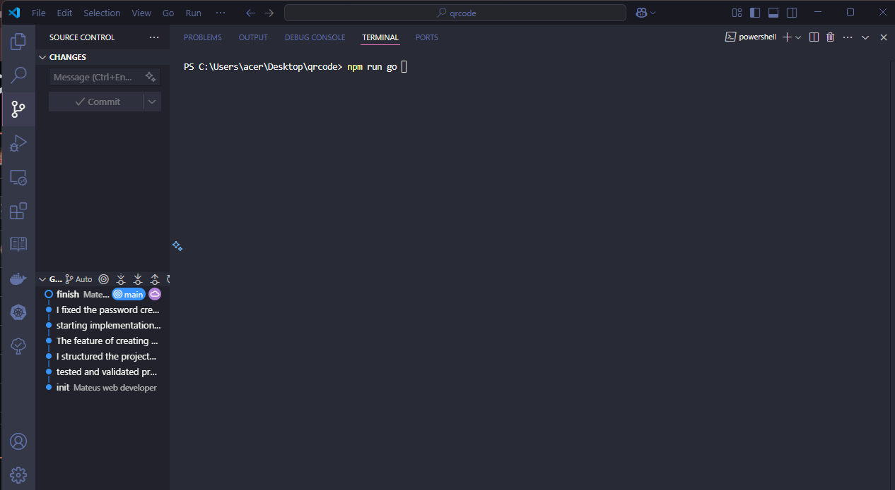
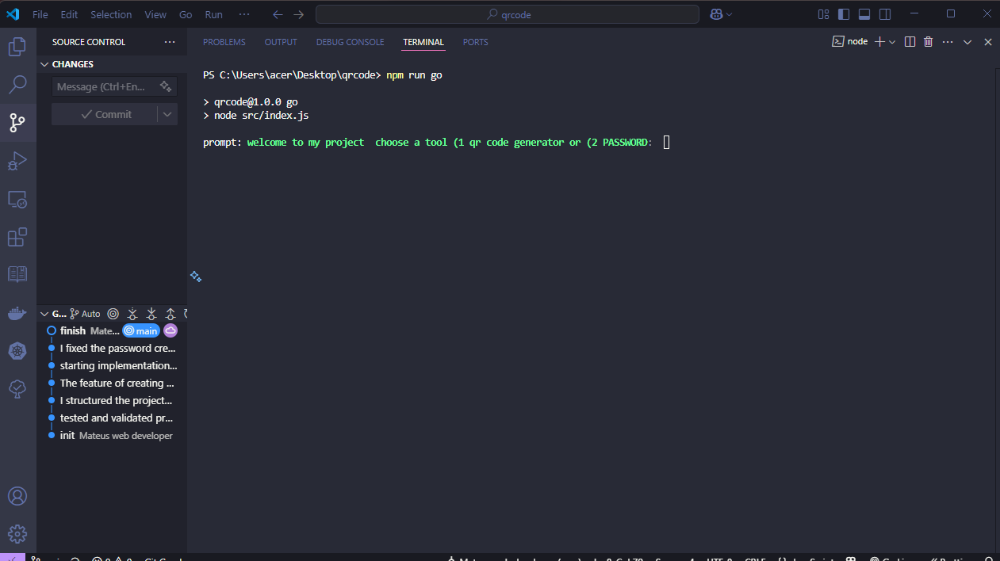
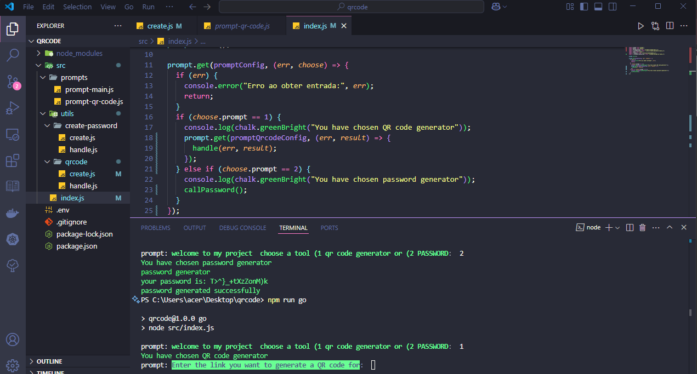
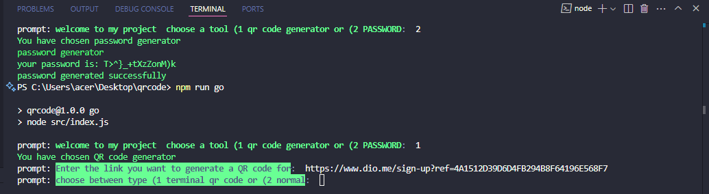
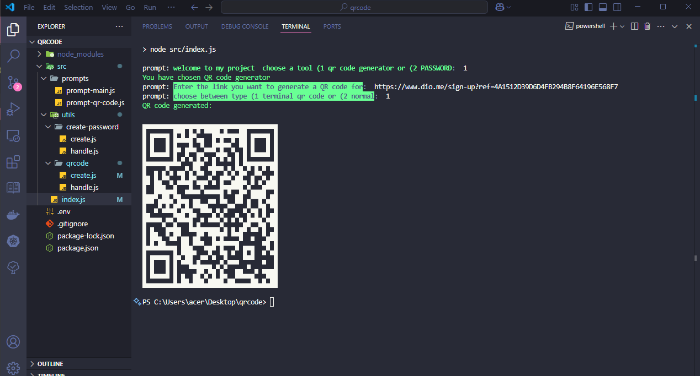
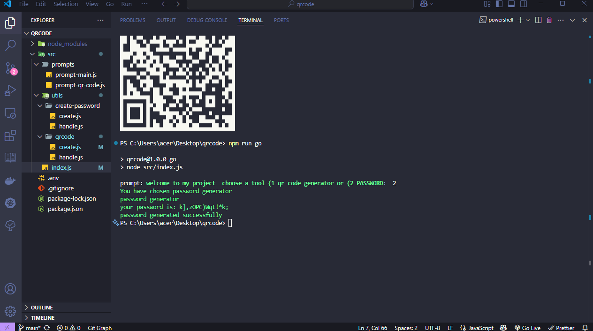

# two-features-on-your-terminal

Este repositório faz exatamente o que o nome sugere: traz **duas funcionalidades úteis direto no seu terminal**! Simples, direto e funcional.

## Features

### 1. Gerador de QR Code
- Gere QR codes funcionais direto do terminal.
- Escolha entre dois tamanhos diferentes (pequeno ou normal).
- Perfeito para compartilhar links rapidamente ou testar QR codes sem sair do terminal.

### 2. Gerador de Senhas
- Crie senhas seguras e personalizadas.
- Você pode escolher se quer letras maiúsculas, minúsculas, números e caracteres especiais.
- Ideal para quem precisa de uma senha forte na hora!

## Como rodar

Clone o repositório:

```
git clone https://github.com/teuzowebdeveloper9/two-feautures-on-your-terminal
```

Entre na pasta do projeto:

```
cd two-feautures-on-your-terminal
```

Instale as dependências:

```
npm install
```

Agora você pode rodar de duas formas:

### 1. Usando meu script pessoal

```
npm run go
```

### 2. Manualmente

```
cd src
node index.js
```

## Experiência de desenvolvimento

A primeira feature (QR code) foi bem fácil de implementar, super tranquila e rápida. Já a segunda feature (gerador de senhas) foi um verdadeiro desafio: enfrentei vários bugs, pesquisei muito em fóruns, conversei com várias IAs (como cursor ou chat gpt) e só consegui resolver quando percebi que estava sendo radical demais na comparação de variáveis. Troquei o `===` por `=` e, finalmente, tudo funcionou como deveria!

## Screenshots







> Escaneie para ganhar o bem mais raro e intomável!


(Aqui estão exemplos do terminal e dos QR codes gerados pelo projeto)

---

Feito com 💻 e muita persistência! 